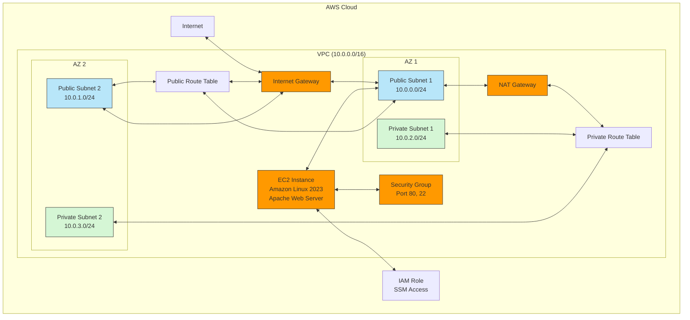

# Web Server Infrastructure Architecture

## Architecture Diagram

## Component Description

1. **VPC**: Virtual Private Cloud with CIDR block 10.0.0.0/16
2. **Subnets**:
   - Public Subnets: For resources that need direct internet access
   - Private Subnets: For resources that need outbound internet access only
3. **Internet Gateway**: Allows communication between VPC and the internet
4. **NAT Gateway**: Allows private subnet resources to access the internet
5. **EC2 Instance**: Web server running Amazon Linux 2023 with Apache
6. **Security Group**: Firewall rules controlling traffic to/from EC2 instance
7. **IAM Role**: Provides permissions for EC2 instance to use AWS services
8. **Route Tables**: Control traffic routing within the VPC

## Security Considerations

- SSH access is restricted to specific IP ranges
- Web server is accessible on port 80 from anywhere
- EC2 instance can be managed via AWS Systems Manager (SSM)
- All outbound traffic is allowed from the EC2 instance
